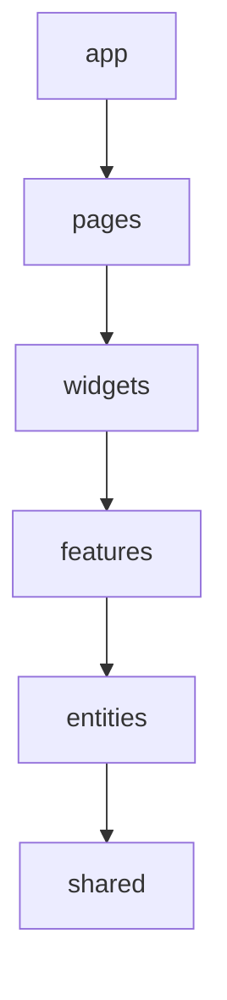

# AI Chats Frontend Web UI

## Основной стэк

 - `React 19+` / `TypeScript`
 - `Vite`
 - `Streamdown` / `Shiki` (для стриминга Markdown и подсветки синтаксиса)
 - `SCSS Modules` - стили

## Архитектура

Резделение приложение не по UI компонентам, а по владению состоянием.

FSD-based структура:
```plain
src/
├── app/
├── pages/
├── widgets/
├── features/
├── entities/
└── shared/
```

Правило зависимостей:



где:
 - `app` - настройки, провайдеры, глобальные стили и инициализация приложения (никакой бизнес логики);
 - `pages` - страницы приложения (компоненты страниц, собирающие интерфейс);
 - `widgets` -  самостоятельные крупные блоки интерфейса (например, Header, Sidebar, ...);
 - `features/flows` - действия пользователя, несущие бизнес-ценность, основные сценарии;
 - `entities` - бизнес-сущности (например, User, ChatMessage, ModelSettings);
 - `shared` - переиспользуемый код без привязки к бизнесу (UI-кит, общие утилиты вроде formatDate, конфигурация API).

Пример структуры (просто пример, не реальная структура):

```plain
src/
├── app/
│   ├── router/
│   ├── providers/
│   ├── styles/
│   └── App.tsx
│
├── pages/
│   ├── chat/
│   ├── models/
│   └── settings/
│
├── widgets/
│   ├── app-sidebar/
│   ├── conversation/
│   ├── chat-composer/
│   ├── model-selector/
│   └── artifact-panel/
│
├── features/
│   ├── send-message/
│   ├── regenerate-message/
│   ├── stop-generation/
│   ├── select-model/
│   ├── attach-file/
│   └── connect-provider/
│
├── entities/
│   ├── conversation/
│   ├── message/
│   ├── run/
│   ├── model/
│   ├── provider/
│   ├── tool-call/
│   ├── artifact/
│   └── attachment/
│
└── shared/
    ├── api/
    ├── config/
    ├── hooks/
    ├── lib/
    ├── styles/
    ├── types/
    └── ui/
```

Внутри slices используем только относительные импорты.

Не нужно городить api слой, лучше BackendCaller (для стриминга можно сделать отдельный) в shared и вызов в сторах

```plain
                    React
                      │
                widgets/features
                      │
                   stores
                 ╱        ╲
                ╱          ╲
      BackendCaller       RunStream
             │               │
           REST         fetch stream/SSE
                ╲         ╱
                  Backend
```

Не создавать api-прослойку только потому, что запрос идёт на backend.
Store/feature может напрямую зависеть от:
BackendCaller

если запрос простой.
Отдельную функцию/adapter создавать только когда:
- endpoint сложный;
- нужен mapper;
- есть несколько HTTP-вызовов;
- хочется скрыть transport specifics;
- операция имеет важное предметное имя;
- это streaming/WebSocket/SSE.